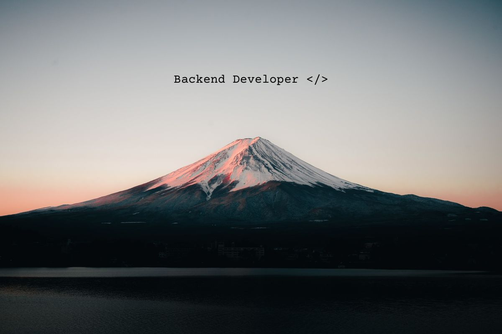

  
  
  

 

## > whoami

I'm a **Systems Analysis & Development** graduate based in Brazil.
My core focus is **Backend Development** with **Java & Spring Boot**, but I also bring a strong background in **Technical Support**, which honed my problem-solving skills.
Currently, I'm expanding my stack with **Python** to build practical projects.

- 🔭 **Working on:** Personal portfolio & Java backend systems.
- 📚 **Studying:** Python fundamentals applied to projects.
- ⚡ **Fun fact:** I believe every complex problem has a simple solution (eventually).

## > ls tech-stack

 

 

## > git log --stat

&nbsp;&nbsp;&nbsp;&nbsp;&nbsp;&nbsp;&nbsp;&nbsp; 

